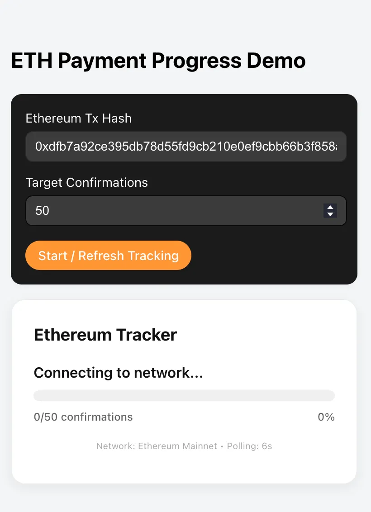
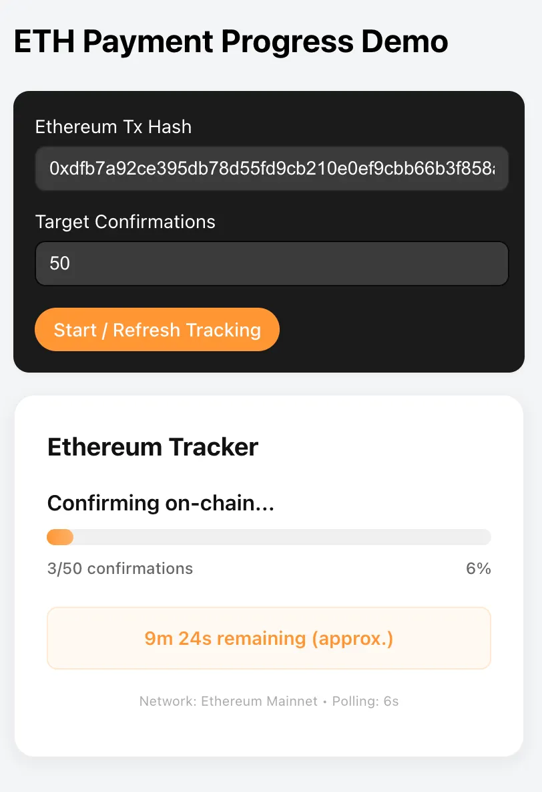
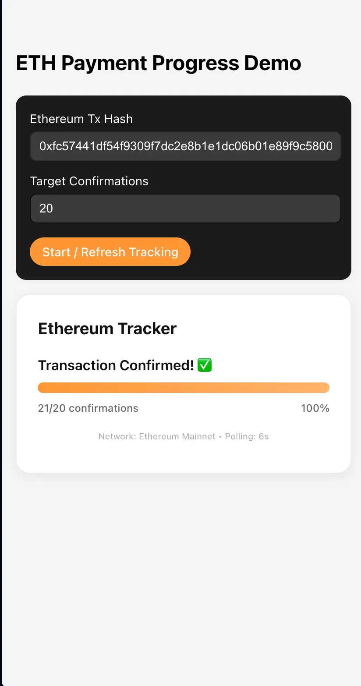

# Ethereum Transaction Confirmation Tracker
A robust, real-time Ethereum monitoring tool that tracks transaction confirmations with high-precision status updates and dynamic ETA calculations.

## Key Features
1. Real-Time Monitoring: Automated polling every 6 seconds to capture the fastest available blockchain updates.

2. High Water Mark Logic: Custom state-management logic that handles "out-of-sync" blockchain nodes, ensuring the UI never flickers or jumps backward (Needed because not all nodes that are being called via Etherscan are up to date with the latest state of the blockchain and often return the "not_found" state.).

3. Cache-Busting Architecture: Implements unique request signatures to bypass browser caching (304 Not Modified) for 100% data freshness.

4. Dynamic ETA: Real-time calculation of remaining time before the transaction is confirmed on the blockchain enough times and considered accepted. Based on average Ethereum block intervals (~12s).

5. UI: Features a progress meter and detailed confirmation stats.

## 🛠️ Technical Implementation

**Distributed System Consistency**

One of the primary challenges was handling Etherscan's load-balanced node architecture. Occasionally (or more precisely - often), an API request would hit a "lagging" node, causing the confirmation count to temporarily drop. This is probably due to the fact that I was using an API key from the free Etherscan account.

The Solution: I implemented a Monotonic Progress Logic in the React layer. The application maintains a "High Water Mark" state, where it only accepts new data if the block confirmation count is strictly greater than the current displayed value.

**Network Efficiency & Rate Limiting**

To ensure the application remains within the Etherscan Free Tier limits while maintaining high responsiveness, I optimized the polling interval to 6 seconds. This "2x block speed" sampling rate improves the chance of catching a newly mined block immediately without triggering 429 Rate Limit errors. You can experiment with different polling intervals and observe the results.

## 📦 Tech Stack
**Frontend**: React, TypeScript, Vite

**Backend**: Node.js, Express, Axios

Blockchain API: [Etherscan](https://etherscan.io/myaccount) (Proxy & RPC modules)

## 🔧 Installation
1. Open your Terminal
1. Clone the repo using this command in your terminal:
```bash
git clone https://github.com/sao-lee/crypto-confirmation-tracker.git
```
### 2. Setup Backend
1. Change the directory to the "backend" folder. You must be in this folder and then move to next steps:
```bash
cd backend
```
2. **Copy the template to a real .env file. This is where you pass your API key that you get from Etherscan**
```bash
cp .env.example .env
```
3. **Open the .env file (which should now be present in the "backend" folder) and paste your Etherscan API key as the value for "ETHERSCAN_API_KEY" variable, before running the next command**

4. **Download necessary libraries to run the code**
```bash
npm install
```
5. **Turn on the stove**
```bash
npm run dev
```

### 3. Setup Frontend
```bash
cd ../frontend
npm install
npm run dev
```

## 📸 Screenshots
<p align="center">



</p>
